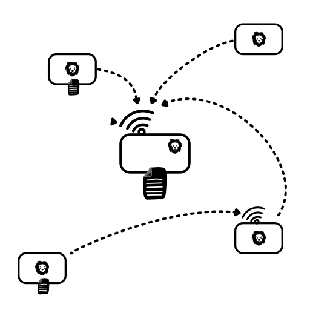

Kore Architecture
=================

At it's heart, **Kore** is built to
support distributed applications.
This is reflected in it's
architecture - think of every
instance of **Kore** as a "node".
It can connect to other nodes,
or store local data, or act as
a server to listen for incoming
connections.

# The Core of Kore

**Kore** manages the storage and
synchronization of logs for your
application.

As you can see, a **Kore** node can
store logs locally, and/or can
connect to other nodes to
synchronize logs, and/or can listen
for connections from other nodes.

To learn how to use **Kore** in all
these modes, go through the "Getting
Started" document.

* [Getting Started](START.md)
